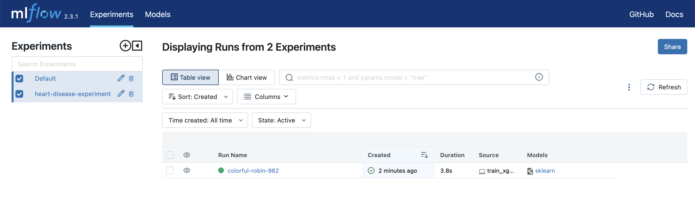

# Final project for MLOps zoomcamp by DataTalks 


## Project Setup ##

Clone the project from the repository
```
git clone https://github.com/bbilmez/MLOps_final_project.git
```

Change to MLOPS_FINAL_PROJECT directory
```
cd MLOPS_FINAL_PROJECT
```

Setup and install project dependencies
```
make setup
```
Add your current directory to python path
```
export PYTHONPATH="${PYTHONPATH}:${PWD}"
```

# Start Local Prefect Server #

In a new terminal window or tab run the command below to start prefect server

```
prefect server start
```

# Start Local Mlflow Server #

In a new terminal window or tab run the following commands below

```
mlflow server
```

# Preprocess data for modeling #
```
python preprocess_data.py --raw_data_path="Data" --dest_path="Output"
```
This python file reads the train/test/valiaton data and extracts predictor and target columns from these dataset.
Then, use DictVectorizer() to convert a dataframes into a numeric feature matrix suitable for machine learning algorithms.


# Running model training and model registery pipelines locally #

```
python train_xgb.py --tracking_uri="http://127.0.0.1:5000" --experiment_name="heart-disease-experiment" --data_path="./Output"
```

This python file starts an MLflow experiment (heart_disease_experiment), train and test a xgboost model using train and validation data and defined parameters. Log this model, its parameters, metrics and DictVectorizer to MLflow. 




```
python hyperoptimization_xgb.py --tracking_uri="http://127.0.0.1:5000" --experiment_name="heart-disease-hyperopt" --num_trials=10 --data_path="./Output"
```

This python file starts another MLflow experiment (heart-disease-hyperopt), search best parameters for xgboost model to obtain highest accuracy. Train and test a xgboost model using these best parameters. Log this model, its parameters, metrics and DictVectorizer to MLflow. 


```
python register_model.py --tracking_uri="http://127.0.0.1:5000" --experiment_name="heart-disease-hyperopt" --top_n=1
```

This python file logs the best model giving highest validation and test accuracy. Register this model to MLflow.


