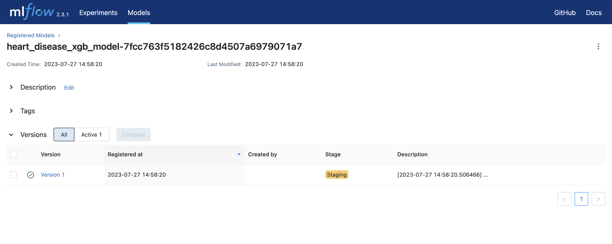
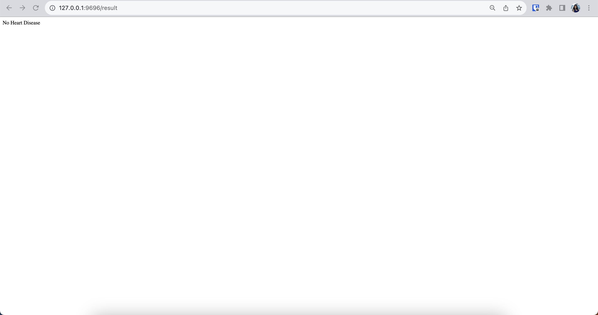

# Final project for MLOps zoomcamp by DataTalks 


## Project Setup ##

Clone the project from the repository
```
git clone https://github.com/bbilmez/MLOpssoomcamp_capstone.git
```

Change to MLOPS_FINAL_PROJECT directory
```
cd MLOPS_FINAL_PROJECT
```

Setup and install project dependencies
```
make setup
```
Add your current directory to python path
```
export PYTHONPATH="${PYTHONPATH}:${PWD}"
```

# Start Local Prefect Server #

In a new terminal window or tab run the command below to start prefect server

```
prefect server start
```

# Start Local Mlflow Server #

In a new terminal window or tab run the following commands below

```
mlflow server
```

# Preprocess data for modeling #
```
python preprocess_data.py --raw_data_path="Data" --dest_path="Output"
```
This python file reads the train/test/valiaton data and extracts predictor and target columns from these dataset.
Then, use DictVectorizer() to convert a dataframes into a numeric feature matrix suitable for machine learning algorithms.


# Running model training and model registery pipelines locally #

```
python train_xgb.py --tracking_uri="http://127.0.0.1:5000" --experiment_name="heart-disease-experiment" --data_path="./Output"
```

This python file starts an MLflow experiment (heart_disease_experiment), train and test a xgboost model using train and validation data and defined parameters. Log this model, its parameters, metrics and DictVectorizer to MLflow. 


```
python hyperoptimization_xgb.py --tracking_uri="http://127.0.0.1:5000" --experiment_name="heart-disease-hyperopt" --num_trials=10 --data_path="./Output"
```

This python file starts another MLflow experiment (heart-disease-hyperopt), search best parameters for xgboost model to obtain highest accuracy. Train and test a xgboost model using these best parameters. Log this model, its parameters, metrics and DictVectorizer to MLflow. 


```
python register_model.py --tracking_uri="http://127.0.0.1:5000" --top_n=1
```

This python file logs the best model giving highest validation and test accuracy. Register this model to MLflow.




# Create scheduled deployments #

```
python deployment.py
```


Run deployments locally

```
prefect deployment run run-optimization/deploy-mlflow-training
prefect deployment run register-best-model/deploy-mlflow-staging
```


# Deploying a model locally #

Add .env file containing environemt variables: EXPERIMENT_ID and RUN_ID.

```
cd web_service/app
python main.py
```
main.py will reach spesified experiment/run and get the artifacts (model and dictionary vectorizer) from this experiment. On your browser, open <http://127.0.0.1:9696/predict>. Fill in the form and after submitting it, the app will direct you to the result page (<http://127.0.0.1:9696/result>) and you will see the prediction.




Without opening prediction server on your browser, prediction could also be done with following lines:

```
curl -X POST -d "Age=57&Sex=M&ChestPainType=ATA&RestingBP=130&Cholesterol=210&FastingBS=0&RestingECG=ST&MaxHR=122&ExerciseAngina=N&Oldpeak=1.5&ST_Slope=Up" http://127.0.0.1:9696/result
```

# Deploying a model as web-service with docker

## Packaging the app to docker

```
docker build -t heart-disease-app:v1 .
```

## Running the docker container service with logs

```
docker run --rm -v $(pwd):/app \
    -p 9696:9696  heart-disease-app:v1
```

## Test the web-service

```
python test.py
```

## Run all the above steps in one command

```
make build_webservice
```

### Model monitoring ###

There are 3 services for monitoring the model predictions is realtime:

Evidently AI for calculating metrics including data drift, missing value and quartile metrics. 
Adminer for collecting monitoring data. Prometheus UI: http://localhost:8080
Grafana for Dashboards UI. Grafana UI: http://localhost:3000 (default user/pass: admin, admin)

To run the script for calculate and report these metrics, follow below steps from project directory.
```
cd model_monitoring
docker-compose up --build
```
and in another terminal tab:
```
python evidently_metric_calculation.py
```

 This script calculates some evidently metrics and save them in as a Postgresql database. This database can be viewed on http://localhost:8080 and dashboards can be made on http://localhost:3000 using this database. The script also saves Evidently report in model_monitoring/reports folder. 


Sample report file: (model_monitoring/reports/data_report-2023-08-18_12-35.html)

