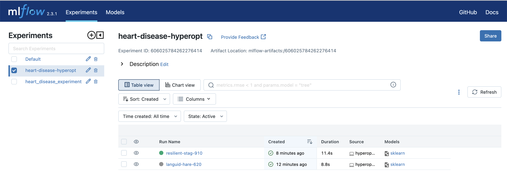

### MLFlow for experiment tracking ###

<u>preprocess_data.py<u>

This python file reads the train/test/valiaton data and extracts predictor and target columns from these dataset.
Then, use DictVectorizer() to convert a dictionary-like object (such as a list of dictionaries or a pandas DataFrame) into a numeric feature matrix suitable for machine learning algorithms.

<u>train_xgb.py<u>

This python file starts an MLflow experiment (heart_disease_experiment), train and test a xgboost model using train and validation data and defined parameters. Log this model, its parameters, metrics and DictVectorizer to MLflow. 

heart_disease_experiment in MLFlow dashboard.

trained model without parameter optimization:

<u>hyperoptimization_xgb.py<u>

This python file starts another MLflow experiment (heart-disease-hyperopt), search best parameters for xgboost model to obtain highest accuracy. Train and test a xgboost model using these best parameters. Log this model, its parameters, metrics and DictVectorizer to MLflow. 

heart_disease_experiment in MLFlow dashboard.

trained model without parameter optimization:
