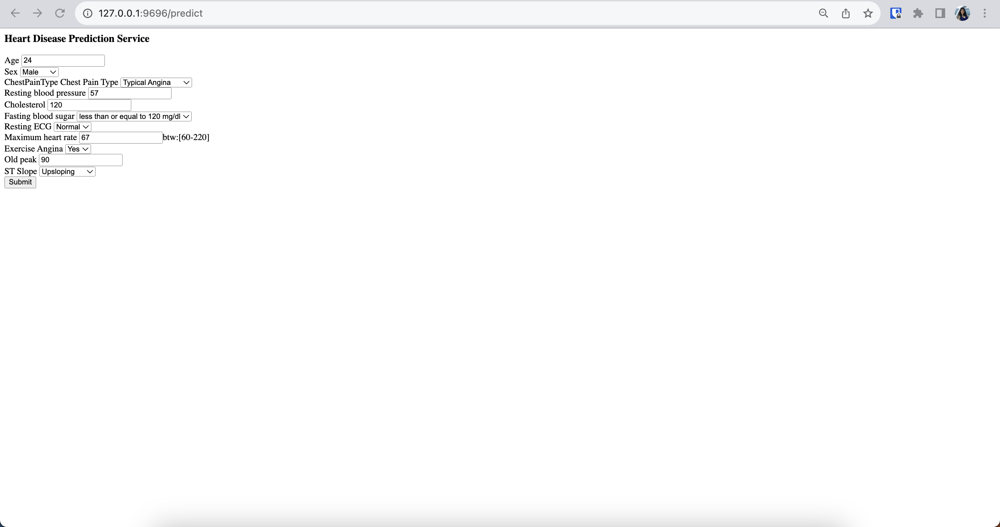
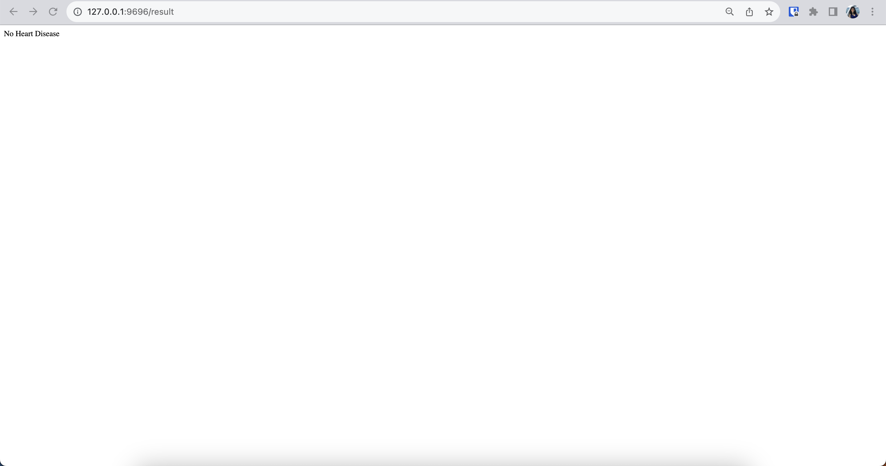

# Deploying a model locally #

Add .env file containing environemt variables: EXPERIMENT_ID and RUN_ID.

```
cd web_service
python main.py
```
main.py will reach spesified experiment/run and get the artifacts (model and dictionary vectorizer) from this experiment. On your browser, open <http://127.0.0.1:9696/predict>. Fill in the form and after submitting it, the app will direct you to the result page (<http://127.0.0.1:9696/result>) and you will see the prediction.




Without opening prediction server on your browser, prediction could also be done with following lines:

```
curl -X POST -d "Age=57&Sex=M&ChestPainType=ATA&RestingBP=130&Cholesterol=210&FastingBS=0&RestingECG=ST&MaxHR=122&ExerciseAngina=N&Oldpeak=1.5&ST_Slope=Up" http://127.0.0.1:9696/result
```

# Deploying a model as web-service with docker

## Packaging the app to docker

```
docker build -t heart-disease-app:v1 .
```

## Running the docker container service with logs

```
docker run --rm -v $(pwd):/app \
    -p 9696:9696  heart-disease-app:v1
```

## Test the web-service

```
python test.py
```

## Run all the above steps in one command

```
make build_webservice
```
